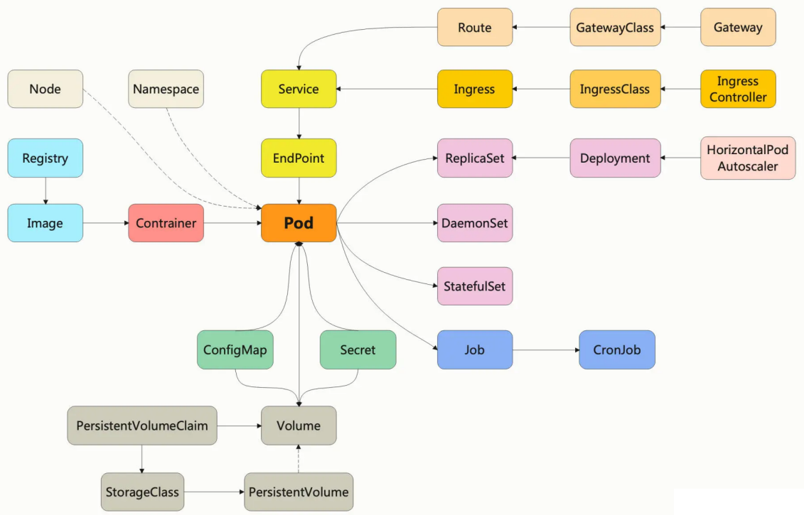

# k8s基本命令

```shell
# 节点查询
kubectl get node -o wide --show-labels

# POD查询
# -A：查询所有命名空间
kubectl get pod -n <namespace>

# 查看当前Kubernetes版本支持的所有API对象
kubectl api-resources
```


##### API对象

Kubernetes 把集群里的一切资源都定义为 API 对象，通过RESTful接口进行管理，描述对象需要使用YAML语言，必须的字段的是 apiVersion、kind、metadata，非必须字段spec

+ apiVersion：表示操作这种资源的API版本号

+ kind：表示资源对象的类型，如Pod、Node、Job等

+ metadata：资源”元信息“，用于标记对象，方便k8s进行管理

查看当前Kubernetes版本支持的所有对象：

```shell
# NAME：对象名字，如ConfigMap、Pod
# SHORTNAMES：资源简写
kubectl api-resources
```

API对象管理命令：

```shell
# 创建API对象
kubectl apply -f ngx-pod.yaml

# 删除API对象
kubectl delete -f ngx-pod.yaml

# 查看kubernetes自带的API文档，即字段解释
kubectl explain pod
kubectl explain pod.metadata
kubectl explain pod.spec
kubectl explain pod.spec.containers

# 生成YAML示例
# 定义shell变量：export out="--dry-run=client -o yaml"
kubectl run ngx --image=nginx:alpine --dry-run=client -o yaml

# --v=9：查看对象管理的过程
kubectl get pod --v=9
```


##### POD

 

POD是Kubernetes应用调度部署的最小单位，里面包含多个容器，这些容器是一个整体，总是能够一起调度、一起运行，共享网络。

POD内部有一个名为infra的容器，实际上代表了POD，维护着Pod内多容器共享的主机名、网络和存储。infra容器的镜像叫”pause“，非常小，只有不到500kb

+ metadata 里面的标签不能任意写，必须要符合域名规范（FQDN）
+ 对于确实不需要重启的Pod，可以配置字段”restartPolicy: Never“
+ kubectl cp/exec 操作的是Pod里的容器，因此需要用 -c 指定容器名，但大多数 Pod 里面只有一个容器，可以省略

```yaml
apiVersion: v1
kind: Pod
metadata:
  name: pod名称
  labels:
    # POD标签，便于k8s进行管理
    region: shanghai
spec:
  # 容器拉起策略
  restartPolicy: restart
  # 容器列表
  containers:
  - image: busybox:latest # 镜像
    name: busy # 容器名称
    # 镜像拉取策略：Always/Never/IfNotPresent（默认，即只有本地不存在才远程拉取镜像）
    imagePullPolicy: IfNotPresent
    # POD的环境变量，类似Dockerfile的ENV指令
    env:
      - name: os
        value: "ubuntu"
    # 定义容器启动时要执行的命令，相当于Dockerfile里的ENTRYPOINT指令
    command:
      - /bin/bash
    # command运行时的参数，相当于Dockerfile里的CMD指令
    args:
      - "$(os), $(debug)"
```

POD相关命令：

```shell
# yaml文件操作
kubectl apply -f busy-pod.yml
kubectl delete -f busy-pod.yml

# 使用指定名称删除POD
kubectl delete pod <pod_name>

# k8s的Podcast只能在后台运行，输出信息不能直接看到，可以通过如下命令查看
kubectl logs <pod_name>

# 查看POD
# -A：查看所有命名空间的POD
kubectl get pod -n <namespace> -o wide

# 查看POD的详细状态
kubectl describe pod <pod_name>

# 将本地文件拷贝进POD
kubectl cp <path> <pod_name>:<pod_path>
kubectl cp <pod_name>:<pod_path> <path>

# 进入POD
kubectl exec -it <pod_name> -c <container_id> -- <command>
```

