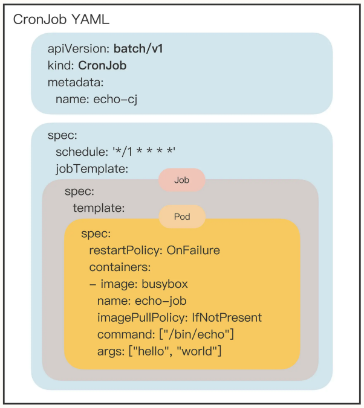
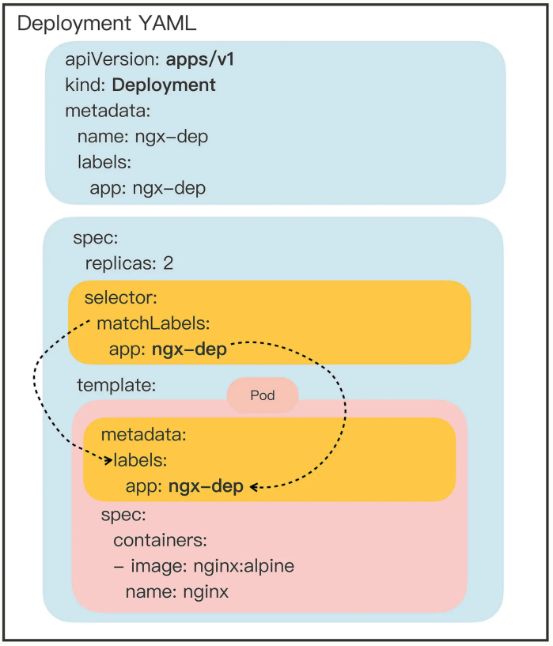
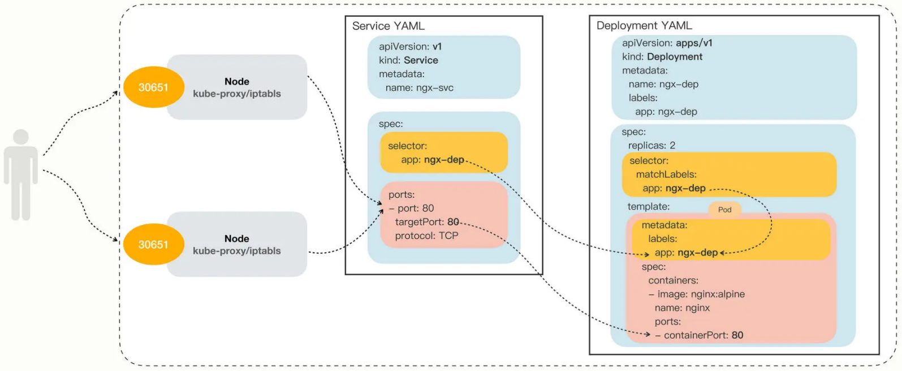

# k8s基本命令

```shell
# 节点查询
kubectl get node -o wide --show-labels

# POD查询
# -A：查询所有命名空间
kubectl get pod -n <namespace>

# 查看当前Kubernetes版本支持的所有API对象
kubectl api-resources
```


k8s官方文档：[https://kubernetes.io/zh-cn/docs/home/](https://kubernetes.io/zh-cn/docs/home/)

k8s技术博客：[https://kubernetes.io/blog/](https://kubernetes.io/blog/)

k8s培训与认证：[https://kubernetes.io/zh-cn/training/](https://kubernetes.io/zh-cn/training/)

CNCF网站：[https://www.cncf.io/](https://www.cncf.io/)


##### API对象

Kubernetes 把集群里的一切资源都定义为 API 对象，通过RESTful接口进行管理，描述对象需要使用YAML语言，必须的字段的是 apiVersion、kind、metadata，非必须字段spec

+ apiVersion：表示操作这种资源的API版本号

+ kind：表示资源对象的类型，如Pod、Node、Job等

+ metadata：资源”元信息“，用于标记对象，方便k8s进行管理

查看当前Kubernetes版本支持的所有对象：

```shell
# NAME：对象名字，如ConfigMap、Pod
# SHORTNAMES：资源简写
kubectl api-resources
```

API对象管理命令：

```shell
# 创建API对象
kubectl apply -f ngx-pod.yaml

# 删除API对象
kubectl delete -f ngx-pod.yaml

# 查看kubernetes自带的API文档，即字段解释
kubectl explain pod
kubectl explain pod.metadata
kubectl explain pod.spec
kubectl explain pod.spec.containers

# 生成YAML示例
# 定义shell变量：export out="--dry-run=client -o yaml"  
# kubectl run：只适用于用来创建POD对象
# kubectl create：用于创建其他对象
kubectl run ngx --image=nginx:alpine --dry-run=client -o yaml

# --v=9：查看对象管理的过程
kubectl get pod --v=9
```


##### namespace

```shell
# 查看命名空间
kubectl get ns

# 创建命名空间
kubectl create ns <ns_name>

# 删除命名空间
kubectl delete ns <ns_name>
```


##### POD

 

POD是Kubernetes应用调度部署的最小单位，里面包含多个容器，这些容器是一个整体，总是能够一起调度、一起运行，共享网络。

POD内部有一个名为infra的容器，实际上代表了POD，维护着Pod内多容器共享的主机名、网络和存储。infra容器的镜像叫”pause“，非常小，只有不到500kb

+ metadata 里面的标签不能任意写，必须要符合域名规范（FQDN）
+ 对于确实不需要重启的Pod，可以配置字段”restartPolicy: Never“
+ kubectl cp/exec 操作的是Pod里的容器，因此需要用 -c 指定容器名，但大多数 Pod 里面只有一个容器，可以省略

```yaml
apiVersion: v1
kind: Pod
metadata:
  name: pod名称
  labels:
    # POD标签，便于k8s进行管理
    region: shanghai
spec:
  # 容器拉起策略
  restartPolicy: restart
  # 容器列表
  containers:
  - image: busybox:latest # 镜像
    name: busy # 容器名称
    # 镜像拉取策略：Always/Never/IfNotPresent（默认，即只有本地不存在才远程拉取镜像）
    imagePullPolicy: IfNotPresent
    # POD的环境变量，类似Dockerfile的ENV指令
    env:
      - name: os
        value: "ubuntu"
    # 定义容器启动时要执行的命令，相当于Dockerfile里的ENTRYPOINT指令
    command:
      - /bin/bash
    # command运行时的参数，相当于Dockerfile里的CMD指令
    args:
      - "$(os), $(debug)"
```

POD相关命令：

```shell
# yaml文件操作
kubectl apply -f busy-pod.yml
kubectl delete -f busy-pod.yml

# 使用指定名称删除POD
kubectl delete pod <pod_name>

# k8s的Podcast只能在后台运行，输出信息不能直接看到，可以通过如下命令查看
kubectl logs <pod_name>

# 查看POD
# -A：查看所有命名空间的POD
kubectl get pod -n <namespace> -o wide

# 查看POD的详细状态
kubectl describe pod <pod_name>

# 将本地文件拷贝进POD
kubectl cp <path> <pod_name>:<pod_path>
kubectl cp <pod_name>:<pod_path> <path>

# 进入POD
kubectl exec -it <pod_name> -c <container_id> -- <command>

# Pod标签筛选：-l参数
# 表达式：==、!=、in、notin
kubectl get pod -l app=nginx
kubectl get pod -l 'app in (ngx, nginx, ngx-dep)'
```


##### ConfigMap/Secret

k8s专门用来管理配置信息的两种对象：ConfigMap和Secret

+ ConfigMap：用于保存明文配置，可以任意查询修改，如服务端口、运行参数等
+ Secret：用来保存机密配置，不能随便查看，如密码、密钥等

ConfigMap，简写为 cm，可以使用kubectl create来创建yaml模板：

```shell
# 生成yaml模板
# --from-literal：从字面值（key-Value结构的值，即k=v）生成ConfigMap
export out="--dry-run=client -o yaml"
kubectl create cm <configMapName> --from-literal=k=v $out

# 通过模板创建cm
kubectl apply -f cm.yaml

# 查看ConfigMap的状态
kubectl get cm <cm_name> -n <namespace>
kubectl describe cm <cm_name> -n <namespace>

# 删除ConfigMap
kubectl delete -f cm.yaml
kubectl delete secret <cm_name> -n <namespace>
```

Secret：

```shell
# kubectl create secret generic：创建yaml模板
# 生成的yaml中root会通过Base64进行编码
export out="--dry-run=client -o yaml"
kubectl create secret generic <secret_name> --from-literal=name=root $out

# shell命令进行base64编码和解码
# echo -n：去掉字符串中隐含的换行符（echo命令默认会添加一个换行符）
# base64 -i：--ignore-garbag，解码时忽略非字母字符
# base64 -d：decode，解码数据
echo -n "value" | base64
echo -n "dmFsdWU=" | base64 -id

# 通过模板创建secret
kubectl apply -f secret.yaml

# 查看secret状态
kubectl get secret <cm_name> -n <namespace>
kubectl describe secret <cm_name> -n <namespace>

# 删除secret
kubectl delete -f secret.yaml
kubectl delete secret <secret_name> -n <namespace>
```


ConfigMap与Secret的使用：

> 注意事项：
>
> + 以环境变量形式使用的ConfigMap，数据不会更新，除非重新启动POD（挂载形式会更新）
> + ConfigMap与Secret最多只支持1MB的数据

```yaml
apiVersion: v1
kind: Pod
metadata:
  name: env-pod
spec:
  containers:
  - image: busybox
    name: busy
    imagePullPolicy: IfNotPresent
    command: ["/bin/sleep", "300"]
    # 挂载成环境变量
    env:
    - name: COUNT  # 环境变量名称
      valueFrom:
        configMapKeyRef:
          name: info  # ConfigMap名称
          key: count  # ConfigMap中定义的key
    - name: USERNAME
      valueFrom:
        secretKeyRef:
          name: user
          key: name
    # 将ConfigMap中的值全部挂载成环境变量，并支持指定前缀
    envFrom:
    - prefix: 'cm_'
      configMapRef:
        name: cm_name
    # 挂载成Volume -- 引用
    # ConfigMap或Secret的每个KV对都会在mountPath下生成一个文件（K为文件名，V为文件内容）
    volumeMounts:
    - mountPath: /tmp/cm-items
      name: cm-vol
    - mountPath: /tmp/sec-items
      name: sec-vol
  
  spec:
    # 挂载成Volume（存储卷） -- 定义
    volumes:
    - name: cm-vol  # 挂载名称
      configMap:
        name: info  # ConfigMap名称
    - name: sec-vol
      secret:
        secretName: user  # Secret名称
```


##### Job/CronJob

任务一般分为2种，一种在线业务，长时间运行；一种离线业务，短时间运行，必定会退出。Job和CronJob就是被设计用来处理离线业务，Job用来处理临时任务，即执行完就结束了；CronJob用于处理定时任务，按时按点周期运行。

Job：

> 注意事项：Job在运行结束后不会立即删除，这是为了方便获取计算结果，但过多的已完成的Job也会消耗系统资源，可以使用字段 ttlSecondsAfterFinished 设置一个保留时限

```shell
# 生成模板
export out="--dry-run=client -o yaml"
kubectl create job <job_name> --image=busybox $out

# 查看字段说明
kubectl explain job
kubectl explain job.apiVersion

# 实时查看Job状态
kubectl get pod -w
```

生成的模板：

```yaml
# 注意apiVersion值是batch/v1，而非v1
apiVersion: batch/v1
kind: Job
metadata:
  name: job_name
spec:
  # Pod运行的超时时间
  activeDeadlineSeconds: 1
  # Pod的失败重试次数
  backoffLimit: 3
  # Job完成需要多少个Pod
  completions: 1
  # 允许并发允许的Pod数量
  parallelism: 1
  # template字段定义了一个应用模板，里面嵌入了一个Pod
  template:
    spec:
      containers:
      - image: busybox
        name: job_name
        resources: {}
      restartPolicy: Never
```


CronJob：简写cj，组合了Job，并添加了schedule字段

> 注意事项：出于节约资源的考虑，CronJob不会无限地保留已经运行的Job，默认只会保留3个最近的执行结果，可以通过字段successfulJobsHistoryLimit设置。

```shell
export out="--dry-run=client -o yaml" # 定义Shell变量
kubectl create cj <cj_name> --image=busybox --schedule="" $out
```

 


##### Deployment

Deployment：用于管理Pod，处理在线任务

```shell
# 创建YAML模板
export out="--dry-run=client -o yaml"
kubectl create deploy ngx-dep --image=nginx:alpine $out
```

生成的yaml模板：

 

+ replicas：副本数量，指定要在k8s集群中运行多少个Pod实例

+ selector：用于筛选出要被Deployment管理的Pod对象，下属字段matchLabels定义了Pod对象应该携带的label，必须要与template.metadata.labels中定义的标签完全相同，否则Deployment 就会找不到要控制的 Pod 对象，apiserver也会告诉你 YAML 格式校验错误无法创建。

  > 通过标签这种设计，Kubernetes 就解除了 Deployment 和模板里 Pod 的强绑定，把 组合关系变成了“弱引用”

操作Deployment：

```shell
# 从yaml创建
kubectl apply -f deploy.yaml

# 查看deployment的状态，状态字段解释如下：
# READY：当前数量/期望数量，表示允许的Pod数量
# UP_TO_DATE：表示已经更新到最新状态的Pod
# AVAILABLE：已经允许，且状态健康能对外正常提供服务的Pod数
kubectl get deploy

# 应用伸缩：调整运行中的Deployment负载的Pod数
# 临时扩容Pod到5个
kubectl scale --replicas=5 deploy nginx-dep
```


##### Daemonset

Daemonset，另一种在线业务API对象，其会在k8s集群的每个节点上都运行一个Pod，就像linux系统里的”守护进程“（Daemon），一般用于与主机存在绑定关系的业务。

+ 网络应用（如 kube-proxy），必须每个节点都运行一个 Pod，否则节点就无法加入 Kubernetes 网络。 
+ 监控应用（如 Prometheus），必须每个节点都有一个 Pod 用来监控节点的状态，实时上报信息。
+ 日志应用（如 Fluentd），必须在每个节点上运行一个 Pod，才能够搜集容器运行时产生的日志数据。
+ 安全应用，同样的，每个节点都要有一个 Pod 来执行安全审计、入侵检查、漏洞扫描等工作

DaemonSet不可以通过kubectl create直接创建，所以也不能自动创建DaemonSet yaml样板的功能。

```yaml
apiVersion: apps/v1
kind: DaemonSet
metadata:
  name: redis-ds
  labels:
    app: redis-ds
spec:
  selector:
    matchLabels:
      name: redis-ds
  template:
    metadata:
      labels:
        name: redis-ds
    spec:
      containers:
      - image: redis:5-alpine
        name: redis
        ports:
        - containerPort: 6379
```

操作DaemonSet：

```yaml
# 创建DaemonSet
kubectl apply -f ds.yaml

# 查看节点状态
kubectl describe node master

# 污点：taint
# -：移除污点
kubectl taint node master node-role.kubernetes.io/master:NoSchedule-

# 容忍度：toleration
# 为Pod添加字段tolerations，让其能够容忍某些污点，就可以在任意的节点上运行
tolerations:
- key: node-role.kubernetes.io/master
  effect: NoSchedule
  operator: Exists
```


静态Pod：不受 Kubernetes 系统的管控，不与 apiserver、scheduler 发生关系，所以是“静态”的。“静态 Pod”的 YAML 文件默认都存放在节点的 /etc/kubernetes/manifests 目录下，它是 Kubernetes 的专用目录。


##### Service

Service：服务发现与负载均衡，Service对象的域名完全形式是`对象.命名空间.svc.cluster.loacl`，很多情况下可以省略后面的部分，直接写`对象.命名空间`

```shell
# 创建yaml模板
# --port：指定映射端口
# --target-port：指定容器端口
# --type=NodePort：用于对外暴露服务
export out="--dry-run=client -o yaml"
kubectl expose deploy ngx-dep [--type=NodePort] --port=80 --target-port=80 $out

# 查看服务详情
kubectl describe svc ngx-svc
```

生成的模板：

```yaml
apiVersion: v1
kind: Service
metadata:
  name: ngx-dep
spec:
  ports:
  - port: 80  # 外部端口
    protocol: TCP  # 协议
    targetPort: 80  # 外部端口 
    type: NodePort
  # 用于过滤要代理的Pod
  selector:
    app: ngx-dep
```

对外暴露端口，使用NodePort：

+ 端口有限，只支持30000-32767
+ 会在每个节点上都开端口，使用kube-proxy路由到真正的后端Service

 

