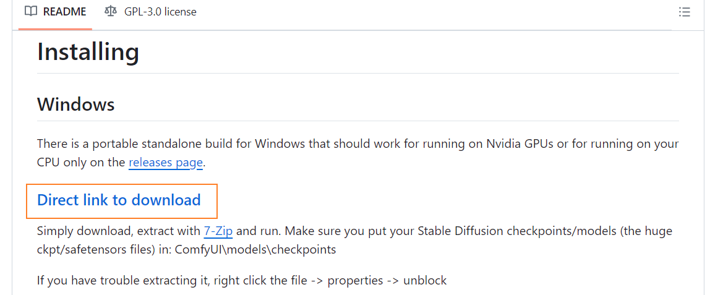
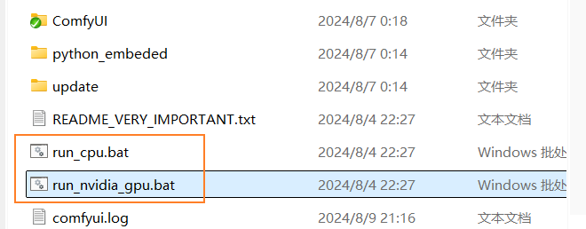
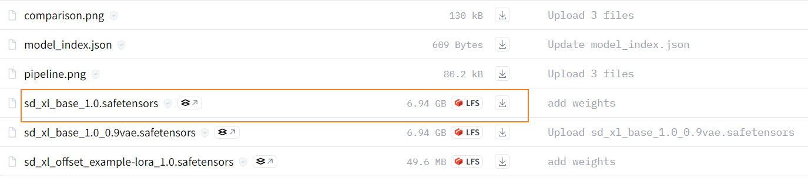
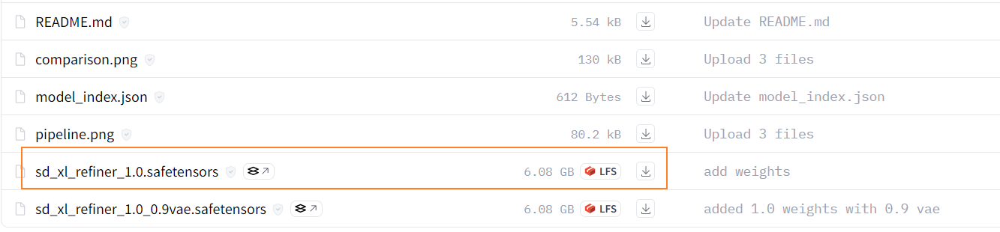
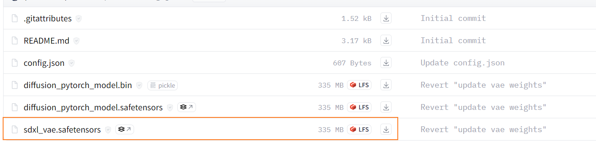
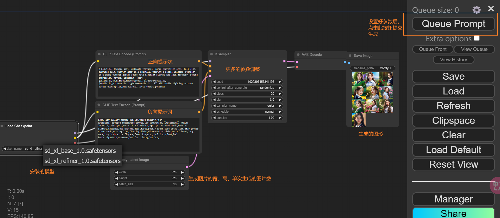

# 在Windows上安装Stable Diffusion

在Windows上使用ComfyUI安装Stable Diffusion步骤：

1. 下载ComfyUI
2. 下载指定的Stable Diffusion模型
3. 将模型放入ComfyUI
4. 运行

注意事项：运行绘图时，Prompt仅支持输入英文，不支持中文。

#### ComfyUI

Github：[https://github.com/comfyanonymous/ComfyUI](https://github.com/comfyanonymous/ComfyUI)

 

点击如上图所示按钮进行下载，并解压，然后根据机器上是否存在Nvida显卡，再决定是使用run_cpu或run_nvida_gpu，双击执行即可：

 

#### 下载Stable Diffusion模型

1、Stable Diffusion XL Base 1.0：基础模型，[https://huggingface.co/stabilityai/stable-diffusion-xl-base-1.0/tree/main](https://huggingface.co/stabilityai/stable-diffusion-xl-base-1.0/tree/main)

 

2、Stable Diffusion XL Refiner 1.0：[https://huggingface.co/stabilityai/stable-diffusion-xl-refiner-1.0/tree/main](https://huggingface.co/stabilityai/stable-diffusion-xl-refiner-1.0/tree/main)

 

3、SDXL-VAE：[https://huggingface.co/stabilityai/sdxl-vae/tree/main](https://huggingface.co/stabilityai/sdxl-vae/tree/main)

 

上述三个模型下载完成后，分别放置到上面ComfyUI解压目录的如下目录：

+ base、refiner以及后续其他模型：…\ComfyUI_windows_portable\ComfyUI\models\checkpoints
+ vae：…\ComfyUI_windows_portable\ComfyUI\models\vae

#### 界面说明

执行ComfyUI下面的run_nvida_gpu.bat，然后打开浏览器访问 [http://127.0.0.1:8188/](http://127.0.0.1:8188/)，界面如下：

 

注意：执行过程中被绿色框起来的代表执行到了这一步。

#### ComfyUI Manager

Github网址：[https://github.com/ltdrdata/ComfyUI-Manager](https://github.com/ltdrdata/ComfyUI-Manager)

安装：在ComfyUI/custom_nodes目录下，执行 `git clone https://github.com/ltdrdata/ComfyUI-Manager.git` 并重启 ComfyUI