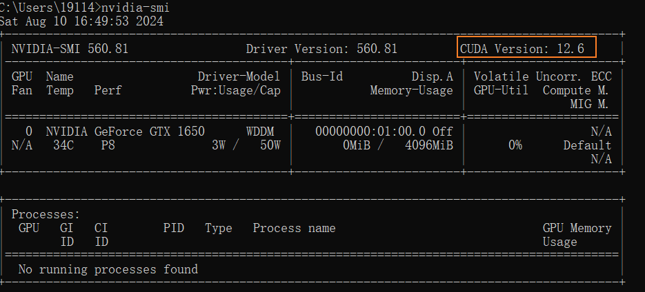
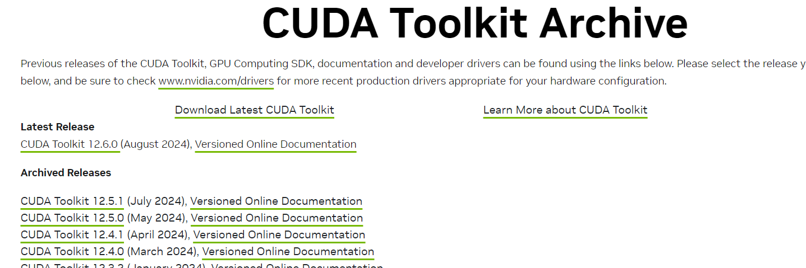
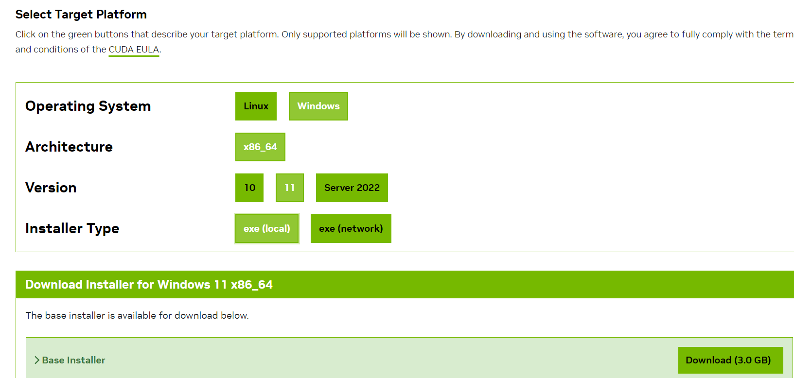
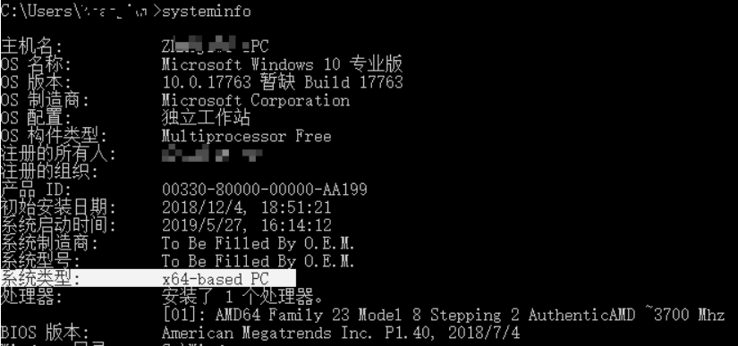
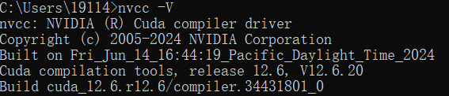

# Windows上安装CUDA

在Windows上安装CUDA：

1、根据显卡型号更新显卡驱动：[https://www.nvidia.cn/drivers/lookup/](https://www.nvidia.cn/drivers/lookup/)

 

2、在cmd窗口输入`nvidia-smi`，其中CUDA Version表示当前驱动支持的最新版本：

 

3、进入CUDA下载页面，下载小于等于上述显示版本的CUDA：[https://developer.nvidia.com/cuda-toolkit-archive](https://developer.nvidia.com/cuda-toolkit-archive)

 

并跟据操作系统和架构选择对应的安装包下载安装：

 

在cmd窗口输入`systeminfo`可以查看操作系统的架构：

 

4、在cmd窗口输入`nvcc -V`，如果正常输出版本号则安装成功：

  
