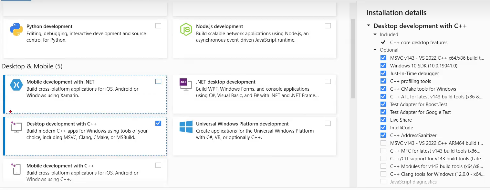
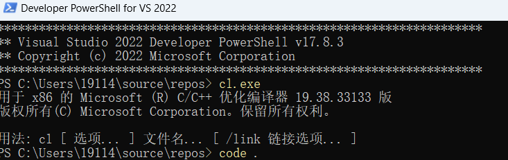
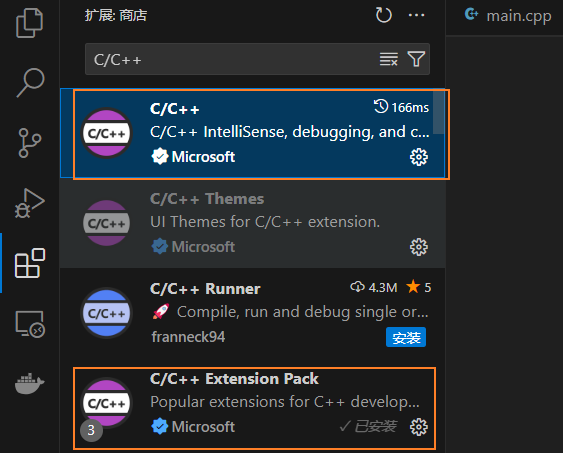
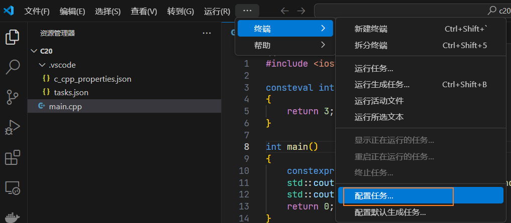
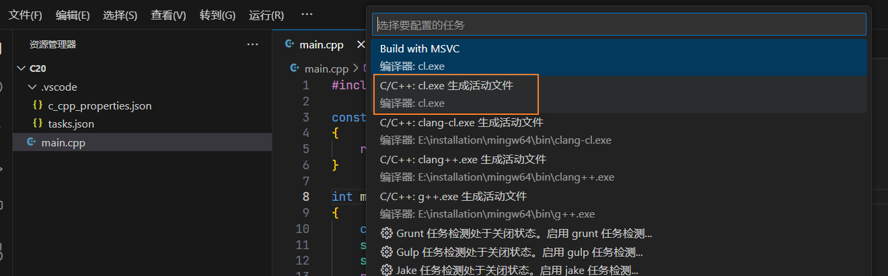
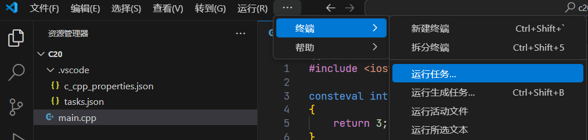
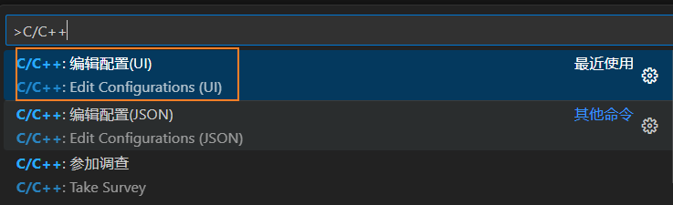
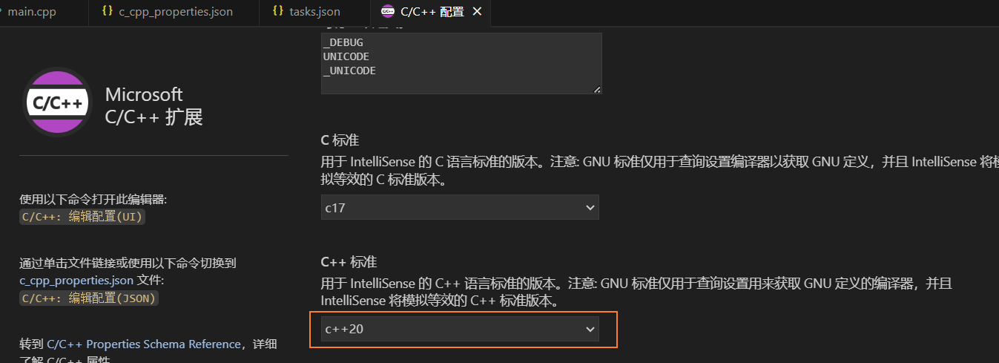
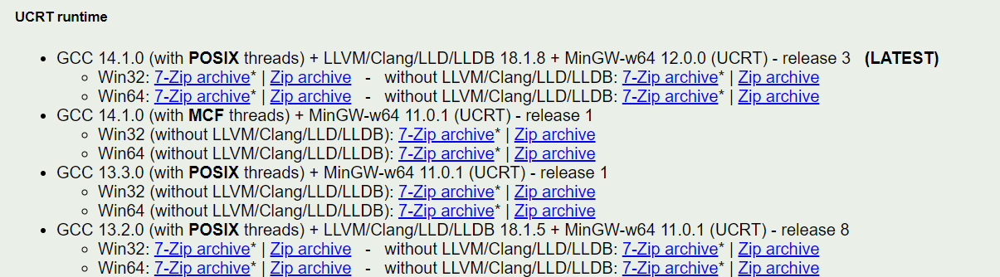
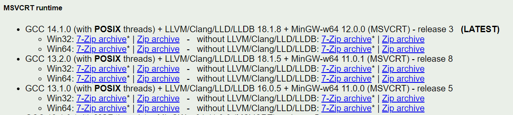

# 环境搭建

#### 下载Visual Studio

Visual Studio下载：

+ 最新版本：[https://visualstudio.microsoft.com/zh-hans/downloads/](https://visualstudio.microsoft.com/zh-hans/downloads/)
+ 旧版本：[https://visualstudio.microsoft.com/zh-hans/vs/older-downloads/](https://visualstudio.microsoft.com/zh-hans/vs/older-downloads/)

选择安装“C++桌面开发”即可：

 


#### Vscode + msvc

Visual Code下载：[https://code.visualstudio.com/](https://code.visualstudio.com/)

在Vscode中使用cl.exe进行编译：

1、在搜索中输入“Developer”，打开下图选中的应用：

 

2、在弹出的窗口中输入code打开Vscode（不使用此种方式打开的话，除非配置好了环境变量，否则在Vscode中不能使用cl.exe中等命令）：

 

3、下载C/C++插件：

 

4、将项目文件拖入Vscode中间窗口打开，并在文件夹下创建main.cpp文件，输入如下内容：

```c++
#include <iostream>

// C++20特性
consteval int get_value()
{
    return 3;
}

int main()
{
    constexpr int value = get_value();
    std::cout << "value: " << value << std::endl;
    return 0;
}
```

5、配置任务：终端 -> 配置任务

 

在弹出的任务中，选择使用cl.exe生成活动文件，然后会在项目根目录生成.vscode/tasks.json：

 

编辑tasks.json文件，修改tasks.args下的内容，使其支持C++20的编译：

```json
{
  "version": "2.0.0",
  "tasks": [
    {
      "type": "cppbuild",
      "label": "Build with MSVC",      // label为任务的名称
      "command": "cl.exe",
      "args": [
        "/Zi",
        "/std:c++latest",
        "/EHsc",
        "/Fe:",
        "${fileDirname}\\rooster.exe",
        "${workspaceFolder}\\*.cpp"
      ],
      "options": {
        "cwd": "${fileDirname}"
      },
      "problemMatcher": ["$msCompile"],
      "group": "build",
      "detail": "编译器: cl.exe"
    }
  ]
}
```

执行编译任务：

 

6、配置编辑器支持C++20：快捷键 Ctrl + Shift + P打开运行，输入 C/C++，选择下图所示

 

C++标准选择C++20即可：

 


#### 下载MinGW-w64

由于官方二进制久未更新，推荐从[WinLibs](https://winlibs.com/)下载第三方编译的新版GCC：

+ 官方网站：[https://winlibs.com/](https://winlibs.com/)
+ github网址：[https://github.com/brechtsanders/winlibs_mingw/releases/](https://github.com/brechtsanders/winlibs_mingw/releases/)

如果下载时较慢，可以使用一些Github加速下载的网站来提高下载速度，如 [https://www.7ed.net/gitmirror/hub.html](https://www.7ed.net/gitmirror/hub.html)

1、win10及以上版本：UCRT runtime版本

 

2、win 10之前的版本：MSVCRT runtime版本

 

下载完成后解压到任意文件夹（注意文件夹路径中不能存在空格），然后将mingw64\bin所在的绝对路径添加到环境变量中（搜索“环境变量”->编辑系统环境变量->环境变量->选中Path点编辑->新建->mingw64\bin所在的绝对路径）。

验证，使用快捷键Win+R打开运行，输入cmd回车后进入控制台，输入如下命令：

```
# 输出版本号即添加成功
g++ --version
clang++ --version
```


#### vscode + mingw

在Vscode中配置GCC编译支持C++20，同上操作，修改tasks.json文件：

```
{
  "version": "2.0.0",
  "tasks": [
    {
      "type": "cppbuild",
      "label": "Build with GCC",
      "command": "E:\\installation\\mingw64\\bin\\g++.exe",
      "args": [
        "-g",
        "-std=c++20",
        "${workspaceFolder}\\*.cpp",
        "-o",
        "${fileDirname}\\rooster.exe"
      ],
      "options": {
        "cwd": "${fileDirname}"
      },
      "problemMatcher": ["$gcc"],
      "group": "build",
      "detail": "编译器: E:\\installation\\mingw64\\bin\\g++.exe"
    }
  ]
}
```

在Vscode中配置Clang编译支持C++20，同上操作，修改tasks.json文件：

```json
{
	"version": "2.0.0",
	"tasks": [
		{
			"type": "cppbuild",
			"label": "Build with Clang",
			"command": "E:\\installation\\mingw64\\bin\\clang++.exe",
			"args": [
				"-g",
				"-std=c++20",
				"${workspaceFolder}\\*.cpp",
				"-o",
				"${fileDirname}\\rooster.exe"
			],
			"options": {
				"cwd": "${fileDirname}"
			},
			"problemMatcher": [
				"$gcc"
			],
			"group": "build",
			"detail": "编译器: E:\\installation\\mingw64\\bin\\clang++.exe"
		}
	]
}
```

在同一个项目中同时使用上述三种编译器，修改tasks.json：

```json
{
    "version": "2.0.0",
    "tasks": [
        {
            "type": "cppbuild",
            "label": "Build with MSVC",
            "command": "cl.exe",
            "args": [
                "/Zi",
                "/std:c++latest",
                "/EHsc",
                "/Fe:",
                "${fileDirname}\\rooster.exe",
                "${workspaceFolder}\\*.cpp"
            ],
            "options": {
                "cwd": "${fileDirname}"
            },
            "problemMatcher": [
                "$msCompile"
            ],
            "group": "build",
            "detail": "编译器: cl.exe"
        },
        {
			"type": "cppbuild",
			"label": "Build with Clang",
			"command": "E:\\installation\\mingw64\\bin\\clang++.exe",
			"args": [
				"-g",
				"-std=c++20",
				"${workspaceFolder}\\*.cpp",
				"-o",
				"${fileDirname}\\rooster.exe"
			],
			"options": {
				"cwd": "${fileDirname}"
			},
			"problemMatcher": [
				"$gcc"
			],
			"group": "build",
			"detail": "编译器: E:\\installation\\mingw64\\bin\\clang++.exe"
		},
        {
            "type": "cppbuild",
            "label": "Build with GCC",
            "command": "E:\\installation\\mingw64\\bin\\g++.exe",
            "args": [
              "-g",
              "-std=c++20",
              "${workspaceFolder}\\*.cpp",
              "-o",
              "${fileDirname}\\rooster.exe"
            ],
            "options": {
              "cwd": "${fileDirname}"
            },
            "problemMatcher": ["$gcc"],
            "group": "build",
            "detail": "编译器: E:\\installation\\mingw64\\bin\\g++.exe"
        }
    ]
}
```

