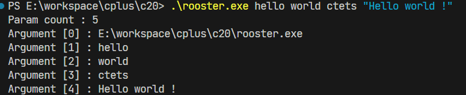

# C++基础

#### 注释

注释分为单行注释和多行注释，其中多行注释不支持嵌套：

```c++
#include <iostream>

/*
    多行注释，不支持嵌套
*/
consteval int get_value()
{
    return 3;
}

// 单行注释
int main()
{
    constexpr int value = get_value();
    std::cout << "value: " << value << std::endl;
    std::cout << "Hello world" << std::endl;
    return 0;
}
```


#### main函数参数

main函数接收两个参数，一个参数个数，一个参数列表，其中参数0代表了程序本身位置：

```c++
#include <iostream>

// int main(int argc, char **argv)
int main(int argc, char *argv[])
{
    std::cout << "Param count : " << argc << std::endl;
    for (int i{0}; i < argc; i++)
    {
        std::cout << "Argument [" << i << "] : " << argv[i] << std::endl;
    }
}
```

编译后运行：

 


