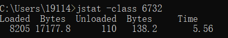
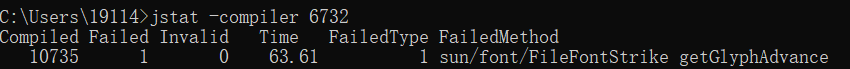
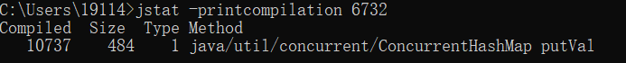
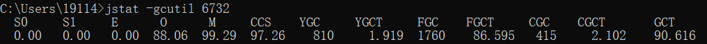
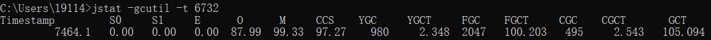

# JVM监控工具

#### jps

jps：JVM Process Status Tool，用于列出正在运行的虚拟机进程，并显示虚拟机执行主类（Main Class，main()函数所在的类）名称以及这些进程的本地虚拟机唯一ID(LVMID，Local Virtual Machine Identifier)。对于本地虚拟机进程来说，LVMID与操作系统的进程ID(PID，Process Identifier)是一致的。

jps命令格式：

```sh
# hostid是可选参数，不输入时表示查询的是本机的虚拟机进程，输入时需要输入RMI注册表中的主机名
# hostid格式（与URI格式基本一致）：[protocol:][[//]hostname][:port][/servername]
jps [options] [hostid]
```

options选项格式：

| 选项 | 作用                                               |
| ---- | -------------------------------------------------- |
| -q   | 只输出LVMID，省略主类的名称                        |
| -m   | 输出虚拟机进程启动时传递给主main()函数的参数       |
| -l   | 输出主类的全名，如果进程执行的是jar包，输出jar路径 |
| -v   | 输出虚拟机进程启动时JVM参数                        |

需要注意的是，**如果某Java进程关闭了默认开启的`UsePerfData`参数（即使用参数`-XX:-UsePerfData`），那么`jps`命令（以及`jstat`）将无法探知该Java进程。**


#### jstat

jstat：JVM Statistics Monitoring Tool，是用于监视虚拟机各种运行状态信息的命令行工具。它可以显示本地或者远程虚拟机进程中的类加载、内存、垃圾收集、即时编译等运行时数据，是运行期定位虚拟机性能问题的常用工具。

jstat命令格式：

```sh
# interval和count代表查询间隔和次数，如果省略这2个参数，说明只查询一次
# 仅设置interval参数而不设置count参数时，可以循环打印直至jdk停止
jstat [ option vmid [interval[s|ms] [count]] ]
```

VMID格式说明：如果是本地虚拟机进程，VMID与LVMID是一致的；如果是远程虚拟机进程，那VMID的格式如下

```
[protocol:][//]lvmid[@hostname[:port]/servername]
```

option表示希望查询的虚拟机信息，主要分为三类：类装载、垃圾回收、运行编译状况

| 选项              | 作用                                                         |
| ----------------- | ------------------------------------------------------------ |
| -class            | 监视类装载、卸载数量、总空间以及类装载所耗费的时间           |
| -gc               | 监视java堆状况，包括Eden区、两个Survivor区、老年代、永久代等的容量、已用空间、GC时间合计等信息 |
| -gccapacity       | 监视内容与 -gc基本相同，但输出主要关注java堆各个区域使用到的最大、最小空间 |
| -gcutil           | 监视内容与 -gc基本相同，但输出主要关注已使用空间站总空间的百分比 |
| -gccause          | 与 -gcutil功能一样，但是会额外输出导致上一次GC产生的原因     |
| -gcnew            | 监视新生代GC状况                                             |
| -gcnewcapacity    | 监视内容与 -gcnew基本相同，输出主要关注使用到的最大、最小空间 |
| -gcold            | 监视老年代GC状况                                             |
| -gcoldcapacity    | 监视内容与 -gcold基本相同，输出主要关注使用到的最大、最小空间 |
| -compiler         | 输出JIT编译器编译过的方法、耗时等信息                        |
| -printcompilation | 输出已经被JIT编译的方法                                      |

查看类装载信息：

 

输出字段说明：

| 参数                           | 说明            |
| ------------------------------ | --------------- |
| Loaded                         | 加载class的数量 |
| Bytes（从左往右数第一个Bytes） | 所占用空间大小  |
| Unloaded                       | 未加载数量      |
| Bytes（从左往右数第二个Bytes） | 未加载占用空间  |
| Times                          | 装载所耗的时间  |

查看编译信息：

 

输出字段说明：

| 参数         | 说明         |
| ------------ | ------------ |
| Compiled     | 编译数量     |
| Failed       | 编译失败数量 |
| Invilid      | 不可用数量   |
| Time         | 编译时间     |
| FailedTypes  | 失败类型     |
| FailedMethod | 失败的方法   |


查看已经被JIT编译过方法：

 

参数说明：

| 参数     | 说明                     |
| -------- | ------------------------ |
| Compiled | 最近编译方法的数量       |
| Size     | 最近编译方法的字节码数量 |
| Type     | 最近编译方法的编译类型   |
| Method   | 方法名标识               |


查看垃圾回收信息：

| 参数  | 说明                                |
| ----- | ----------------------------------- |
| S0C   | Survivor0的大小                     |
| S1C   | Survivor1的大小                     |
| S0U   | Survivor0区已使用空间大小           |
| S1U   | Survivor1区已使用空间大小           |
| EC    | Eden区的大小                        |
| EU    | Eden区已使用的空间大小              |
| OC    | 老年代（Old）区的大小               |
| OU    | 老年代区已使用空间大小              |
| MC    | 方法区大小                          |
| MU    | 方法区已使用空间大小                |
| CCSC  | 压缩类空间大小                      |
| CCSU  | 压缩类空间已使用大小                |
| YGC   | 年轻代垃圾回收次数，YGC表示Young GC |
| YGCT  | 年轻代垃圾回收总耗时                |
| FGC   | 老年代垃圾回收次数，FGC表示Full GC  |
| FGCT  | 老年代来及回收总耗时                |
| GCT   | 垃圾回收总消耗时间                  |
| NGCMN | 新生代最小容量                      |
| NGCMX | 新生代最大容量                      |
| NGC   | 当前新生代容量                      |
| OGCMN | 老年代最小容量                      |
| OGCMX | 老年代最大容量                      |
| OGC   | 当前老年代容量                      |
| MCMN  | 方法区最小容量                      |
| MCMX  | 方法区最大容量                      |
| CCSMN | 压缩类空间最小容量                  |
| CCSMX | 压缩类空间最大容量                  |
| S0    | Survivor0区                         |
| S1    | Survivor1区                         |
| E     | Eden区                              |
| O     | 老年代                              |
| M     | 方法区                              |
| CCS   | 压缩类                              |
| TT    | 对象在新生代存活的次数              |
| MTT   | 对象在新生代存活的最大次数          |
| DSS   | 期望的一个Survivor区的大小          |
| S0CMX | Survivor0区最大容量                 |
| S1CMX | Survivor1区最大容量                 |
| ECMX  | Eden区最大容量                      |


jstat -gc输出内容说明：

  

2个Survivor区（S0、S1，表示Survivor0、Survivor1）、新生代Eden区（E，表示Eden）是空的，老年代(O，表示Old)和元空间（M，表示Metaspace，在jdk1.7之前为永久代P，表示Permanent）分别使用了88.06%和99.29%的空间。程序运行以来共发生Minor GC（YGC，表示Young GC）810次，总耗时1.919秒；发生Full GC（FGC，表示Full GC）1760次，总耗时（FGCT，表示Full GC Time）为96.595秒；所有GC总耗时（GCT，表示GC Time）为90.616。

CGC和CGCT，分别代表并发GC Stop-The-World的次数和时间。可以比较Java进程的启动时间以及总GC时间（GCT列），或者两次测量的间隔时间以及总GC时间的增量，来得出GC时间占运行时间的比例。如果该比例超过20%，则说明目前堆的压力较大；如果该比例超过90%，则说明堆里几乎没有可用空间，随时都可能抛出OOM异常。

jstat 支持使用`-t`将在每行数据之前打印目标Java进程的启动时间，示例如下：

 


#### jinfo

jinfo：Configuration Info for Java，实时查看虚拟机各项参数，包括传递给Java虚拟机的`-X`（即输出中的jvm_args）、`-XX`参数（即输出中的VM Flags），以及可在Java层面通过`System.getProperty`获取的`-D`参数（即输出中的System Properties）。

其他查看Java进程参数的方式：

```shell
# 查看参数默认值，jdk1.6及以上版本可用
java -XX:+PrintFlagsFinal

# 仅可查看虚拟机启动时显式指定的参数列表
jps -v
```

jinfo还可以用来修改**目标Java进程的“manageable”虚拟机参数**：

```shell
# 查看jvm manageable参数列表
java -XX:+PrintFlagsFinal -version | grep manageable
```

jinfo命令格式：

```shell
jinfo [ option ] pid
```

jinfo使用示例：

```shell
# -flag name：显示指定名称对应的配置参数
jinfo -flag PrintGC PID

# -flag [+|-]name：启用或禁用指定名称的参数，该参数必须为Boolean类型
# 开启简单GC日志模式
jinfo -flag +PrintGC PID
# 禁用简单GC模式
jinfo -flag -PrintGC PID

# -flag name=value：不需要重启Java虚拟机，修改指定名称的参数为指定的值
# 修改空闲堆空间的最小百分比（MinHeapFreeRatio）为30%
info -flag MinHeapFreeRatio=30 PID

# -flags：显示全部的配置参数
jinfo -flags PID

# -sysprops：以键值对的方式显示当前Java虚拟机的全部的系统属性
jinfo -sysprops PID
```


#### jmap

jmap：Memory Map for Java，一般用于生成堆转储快照（一般称为heapdump或dump文件）。其他生成转储文件的方式：

+ `-XX:+HeapDumpOnOutOfMemoryError`：可以让虚拟机在内存溢出异常出现之后自动生成堆转储快照文件
+ `-XX:+HeapDumpOnCtrlBreak`：参数则可以使用[Ctrl]+[Break]键让虚拟机生成堆转储快照文件
+ `-XX:+HeapDumpBeforeFullGC`与`-XX:+HeapDumpAfterFullGC`：在Full GC前后自动生成Dump文件
+ `-XX:+HeapDumpOnOutOfMemoryError`：在产生OOM异常时自动生成dump文件
+ 在Linux系统下通过`Kill -3`命令发送进程退出信号

jmap还可以查询finalize执行队列、Java堆和方法区的详细信息，如空间使用率、当前用的是哪种收集器等。命令格式如下：

```sh
jmap [ option ] vmid
```

option参数说明：

| 选项           | 作用                                                         |
| -------------- | ------------------------------------------------------------ |
| -dump          | 生成java堆转储快照。格式为：`-dump:[live,]format=b,file=<filename>`，其中live子参数说明是否只dump出存活对象 |
| -finalizerinfo | 显示在F-Queue中等待Finalizer线程执行finalize方法的对象       |
| -heap          | 显示java堆详细信息，如使用哪种回收器、参数配置、分代状况等   |
| -histo         | 显示堆中对象统计信息，包括类、实例数量、合计容量             |
| -clstats       | 以ClassLoader为统计入口                                      |
| -F             | 当虚拟机进程对 -dump 没有响应时，可使用这个选项强制生产dump快照 |

注意事项：

1. 由于jmap将访问堆中的所有对象，为了保证在此过程中不被应用线程干扰，`jmap`需要借助安全点机制，让所有线程停留在不改变堆中数据的状态。如果某个线程长时间无法跑到安全点，则jmap会一直等待（jstat是直接读取垃圾回收器在固定位置的数据，不会等待）。
2. `jmap`、`jinfo`、`jstack`和`jcmd`依赖于Java虚拟机的Attach API，因此只能监控本地Java进程。在开启Java虚拟机参数 `-XX:+DisableAttachMechanism` 后，基于Attach API的命令将无法执行。


#### jhat

jhat：JVM Heap Analysis Tool，与jmap搭配使用，用于分析jmap生成的转储文件。jhat内置了一个微型的HTTP/Web服务器，生成堆转储快照的分析结果后，可以在浏览器中查看。
