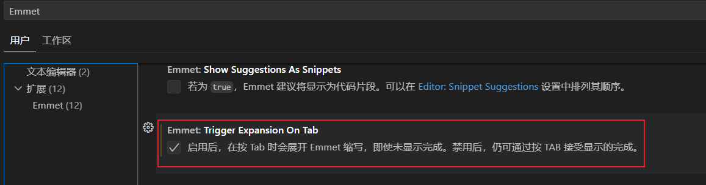

package.json中`dependencies`字段与`devDependencies`字段的区别：

- `dependencies`：它包含的依赖包是需要发布到生产环境中的，是项目正常运行必须依赖的包。
- `devDependencies`：它包含的依赖包只在开发时使用，不用于生产环境，如果只需要项目正常运行，则不必安装这里面的包。

npm install package 安装某个依赖包：

```shell
# 不加参数或添加--save参数：安装包并将依赖名称写入package.json的dependencies字段
npm install [--save] <packageName>

# --save-dev：安装包并将依赖名称写入package.json的devDependencies字段
# 注意：安装依赖包时，包中package.json的dependencies字段中的依赖会被自动安装，而devDependencies字段中的依赖不会被安装。
npm install --save-dev <packageName>
```

npm install 初始化：

```shell
# 无参数：项目package.json中dependencies字段和devDependencies字段中的依赖包都会被安装
npm install

# --production：只安装dependencies字段中的依赖包
npm install --production

# --only=dev：只安装devDependencies字段中的依赖包
npm install --only=dev
```


#### 环境搭建

##### 初始化vue 3项目

初始化Vue 3项目：[https://cn.vitejs.dev/guide/](https://cn.vitejs.dev/guide/)

```shell
# 初始化项目
npm init vite@latest
> Project name: projectName
> Select a framework: Vue
> Select a variant: TypeScript

# 安装依赖
cd projectName
npm install

# 运行测试
npm run dev
```

##### 安装pinia

pinia官网：[https://pinia.vuejs.org/zh/introduction.html](https://pinia.vuejs.org/zh/introduction.html)

```shell
# 安装pinia（刷新丢失）
npm i pinia --save

# 安装vueuse
npm i @vueuse/core --save

# 安装vant ui
npm i vant --save
```


网址：

+ [pinia-plugin-persistedstate](https://prazdevs.github.io/pinia-plugin-persistedstate/zh/)：Pinia状态持久化存储组件
+ https://element-plus.org/zh-CN/：Element plus组件库
+ https://www.npmjs.cn/：npm中文文档
+ [https://www.axios-http.cn/docs](https://www.axios-http.cn/docs)：axios
+ [https://blog.csdn.net/u011943534/article/details/129217179](https://blog.csdn.net/u011943534/article/details/129217179)：java加密工具类
+ 

```shell
# 安装vue-router
npm i vue-router@4 --save

# pinia持久化插件
npm i pinia-plugin-persistedstate

# 移除插件

npm r/remove xxx
```


iconfont（阿里巴巴矢量库）：[https://www.iconfont.cn/](https://www.iconfont.cn/)

```shell
# nprogress：页面跳转进度条
npm install --save nprogress

# md5js：MD5加密
npm install md5js

# axios：https://www.axios-http.cn/docs
npm install axios
```


#### Vscode

##### .vue 文件 html/css 智能提示

VSCode v1.15.1+版本，.vue文件输入html/css不会智能提示，此时需要通过安装HTML Snippets或者Vetur插件，然后在VSCode配置文件settings.json进行配置。

```json
{
    // 在配置后面追加
    "emmet.triggerExpansionOnTab": true,
    "emmet.includeLanguages": {
        "vue-html":"html",
        "vue":"html"
    },
    "files.associations": {
        "*.vue": "html"
    }
}
```

注意：vscode右下角的文件类型是否与实际一致，如果不一致需要手动修改。


##### Emmet自动补全

新版本vscode默认不启用Emmet自动补全，需要在首选项配置中将`emmet.triggerExpansionOnTab`设置为true。

 

Emmet基本语法：简写 + Tab

+ 生成html文档：!
+ 标签补全：标签名
+ 子代：>
+ 同代：+
+ 多个：*
+ 元素属性：#（id）、.（类名）
+ 序号：$

